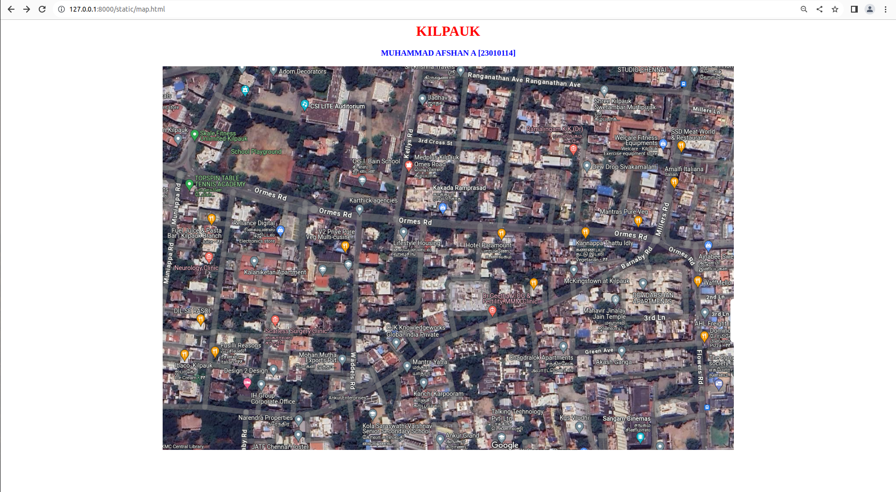
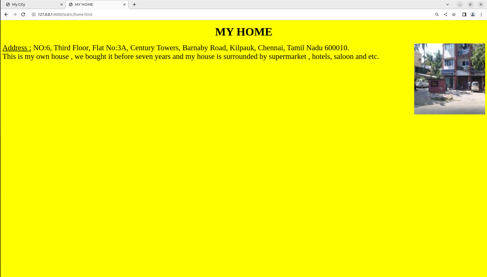
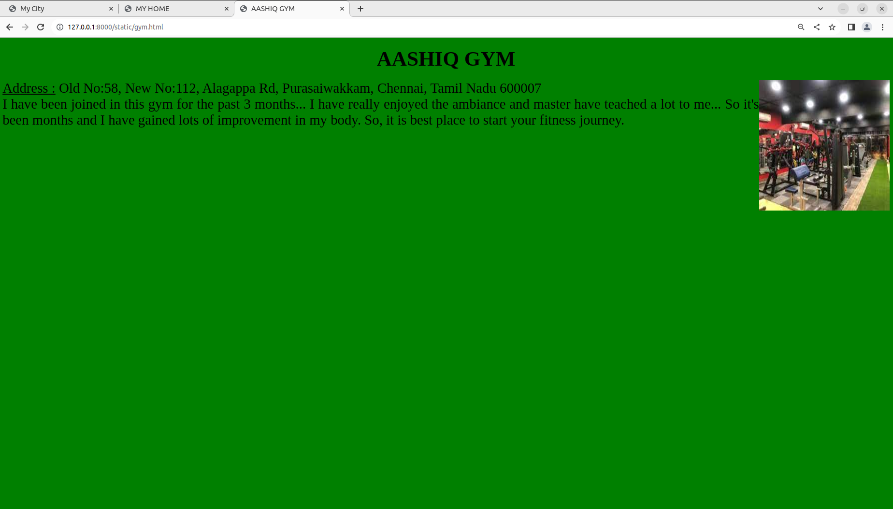
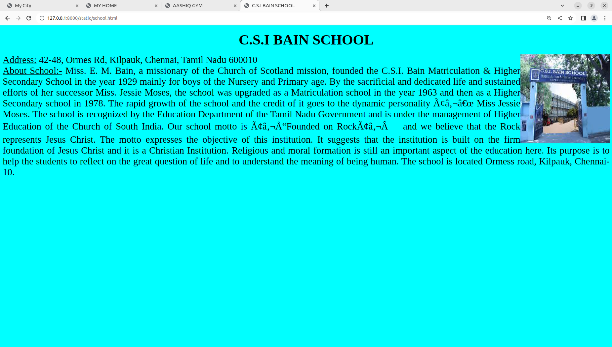
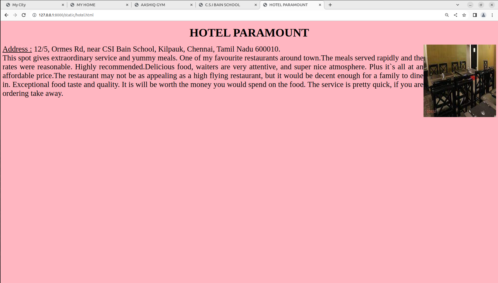
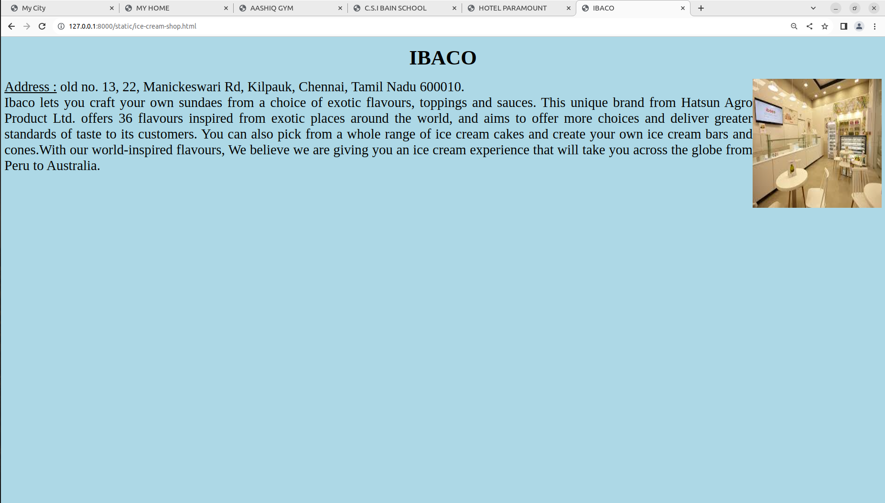

# Places Around Me
## AIM:
To develop a website to display details about the places around my house.

## Design Steps:

### Step 1:
Clone the repository in ex04 from github and Create a Django project Create a folder 'static' under the project folder 'myproject'.
### Step 2:
In 'static', create another folder 'html', under which the file 'map.html' should be created.
### Step 3:
Go to Google Maps and take a screenshot of your home or your area along with some places around it.
### Step 4:
Using <map> tag name the map. 
### Step 5: 
Create  5 clickable regions in the image using <area> tag along with coordinates.
### Step 6:
Write HTML programs for all the regions identified.
### Step 7:
Execute the programs and publish them.

## Code:
### map.html:
```
<html>
<head>
<title>My City</title>
</head>
<body>
<h1 align="center">
<font color="red"><b>KILPAUK</b></font>
</h1>
<h3 align="center">
<font color="blue"><b>MUHAMMAD AFSHAN A [23010114]</b></font>
</h3>
<center>

<map name="image_map">
  <area alt="HOME" title="HOME" href="home.html" coords="905,450,986,515" shape="rect">
  <area alt="HOTEL PARAMOUNT" title="HOTEL PARAMOUNT" href="hotel.html" coords="730,370,823,440" shape="rect">
  <area alt="C.S.I BAIN SCHOOL" title="C.S.I BAIN SCHOOL" href="school.html" coords="406,184,551,335" shape="rect">
  <area alt="AASHIQ GYM" title="AASHIQ GYM" href="gym.html" coords="1207,361,1262,414" shape="rect">
  <area alt="IBACO" title="IBACO" href="ice-cream-shop.html" coords="24,646,111,739" shape="rect">
</map>  
</center>
</body>
</html>
```
### home.html:
```
<!DOCTYPE html>
<html>
<head>
    <title>MY HOME</title>
</head>
<body bgcolor="yellow">
   <h1 align="center"><font size="10">MY HOME</font></h1>
   
   <p align="justify">
    <font face="Georgia" size="6">
    <u>Address :</u> NO:6, Third Floor, Flat No:3A, Century Towers, Barnaby Road, Kilpauk, Chennai, Tamil Nadu 600010.<br>
    This is my own house , we bought it before seven years and my house is surrounded by supermarket , hotels, saloon and etc.
    </font>
   </p>
</body>
</html>

```
### gym.html:
```
<!DOCTYPE html>
<html>
<head>
    <title>AASHIQ GYM</title>
</head>
<body bgcolor="green">
    
    <h1 align="center"><font size="10">AASHIQ GYM</font></h1>
    
    <p align="justify">
        <font face="Georgia" size="6">
    <u>Address :</u> Old No:58, New No:112, Alagappa Rd, Purasaiwakkam, Chennai, Tamil Nadu 600007<br>
    I have been joined in this gym for the past 3 months... I have really enjoyed the ambiance and master have teached a lot to me... 
    So it's been months and I have gained lots of improvement in my body. So, it is best place to start your fitness journey.
        </font>
    </p> 
</body>
</html>
```
### school.html:
```
<!DOCTYPE html>
<html>
<head>
    <title>C.S.I BAIN SCHOOL</title>

</head>

<body bgcolor="cyan">
   <h1 align="center"><font size="10">C.S.I BAIN SCHOOL</font></h1>
   
   <p align="justify">
    <font face="Georgia" size="6">
    <u>Address:</u> 42-48, Ormes Rd, Kilpauk, Chennai, Tamil Nadu 600010<br>
    <u>About School:-</u>
    Miss. E. M. Bain, a missionary of the Church of Scotland mission, founded the C.S.I. Bain Matriculation & Higher Secondary School in the year 1929 mainly 
    for boys of the Nursery and Primary age. By the sacrificial and dedicated life and sustained efforts of her successor Miss. Jessie Moses, the school was 
    upgraded as a Matriculation school in the year 1963 and then as a Higher Secondary school in 1978. The rapid growth of the school and the credit of it goes
    to the dynamic personality – Miss Jessie Moses. The school is recognized by the Education Department of the Tamil Nadu Government and is under the 
    management of Higher Education of the Church of South India. Our school motto is “Founded on Rock” and we believe that the Rock represents Jesus Christ.
    The motto expresses the objective of this institution. It suggests that the institution is built on the firm foundation of Jesus Christ and it is a Christian
    Institution. Religious and moral formation is still an important aspect of the education here. Its purpose is to help the students to reflect on the great 
    question of life and to understand the meaning of being human. The school is located Ormess road, Kilpauk, Chennai-10.
    </font>
   </p>
</body>
</html>
```
### hotel.html:
```
<!DOCTYPE html>
<html>
<head>
    <title>HOTEL PARAMOUNT</title>
</head>
<body bgcolor="lightpink">
    
    <h1 align="center"> <font size="10">HOTEL PARAMOUNT</font></h1>
    
    <p align="justify">
        <font face="Georgia" size="6">
    <u>Address :</u> 12/5, Ormes Rd, near CSI Bain School, Kilpauk, Chennai, Tamil Nadu 600010.<br>
    This spot gives extraordinary service and yummy meals. One of my favourite restaurants around town.The meals served rapidly and the rates were reasonable. Highly recommended.Delicious food, waiters are very attentive, and super nice atmosphere.
    Plus it`s all at an affordable price.The restaurant may not be as appealing as a high flying restaurant, but it would be decent enough for a family to dine in. Exceptional food taste
    and quality. It is will be worth the money you would spend on the food. The service is pretty quick, if you are ordering take away.
        </font>
    </p> 
</body>
</html>
```
### ice-cream-shop.html:
```
<html>
<head>
    <title>IBACO</title>
</head>
<body bgcolor="lightblue">
    
    <h1 align="center"><font size="10">IBACO</font></h1>
    
    <p align="justify">
        <font face="Georgia" size="6">
    <u>Address :</u> old no. 13, 22, Manickeswari Rd, Kilpauk, Chennai, Tamil Nadu 600010.<br>
    Ibaco lets you craft your own sundaes from a choice of exotic flavours, toppings and sauces. This unique brand from Hatsun Agro Product Ltd. offers
    36 flavours inspired from exotic places around the world, and aims to offer more choices and deliver greater standards of taste to its customers.
    You can also pick from a whole range of ice cream cakes and create your own ice cream bars and cones.With our world-inspired flavours,
    We believe we are giving you an ice cream experience that will take you across the globe from Peru to Australia.
        </font>
    </p> 
</body>
</html>
```


## Output:









## Result:
The Program for Implementing Image Maps using HTML is executed successfully.